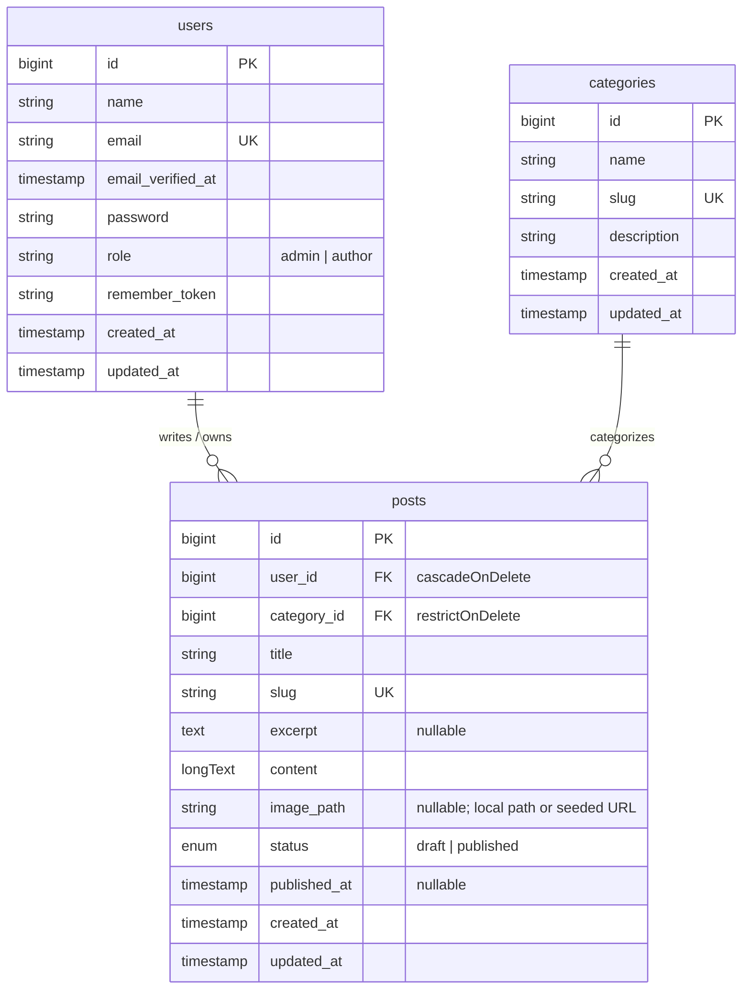

# Mini CMS

A lightweight content management system with a Laravel API and a Next.js App Router frontend. Mini CMS includes a public editorial blog, role-aware dashboards, Markdown publishing, and cover image management.

## Tech Stack

### Backend

- Laravel 13 and PHP 8.3+
- Laravel Sanctum cookie-based authentication
- MySQL and Eloquent ORM
- Public filesystem storage for uploaded post covers

### Frontend

- Next.js 16, React 19, and TypeScript
- TanStack React Query and Zustand
- React Hook Form and Zod
- Tailwind CSS 4, shadcn/ui, and Lucide icons
- react-markdown and remark-gfm

## Prerequisites

Install these tools before starting:

- PHP 8.3 or newer with PDO MySQL, OpenSSL, Mbstring, Fileinfo, and GD
- Composer 2
- Node.js 20.9 or newer and npm
- MySQL 8 or a compatible MySQL server

Keep both applications on `localhost` during local development. Mixing `localhost` and `127.0.0.1` can prevent Sanctum session cookies from working correctly.

## Installation

Clone the repository and enter its root directory:

```bash
git clone https://github.com/fthliqml/mini-cms.git
cd mini-cms
```

### 1. Start the backend

Open the first terminal from the repository root:

```bash
cd backend
composer install
cp .env.example .env
php artisan key:generate
```

On Windows PowerShell, `Copy-Item .env.example .env` can be used instead of `cp`.

Update these values in `backend/.env` if your MySQL configuration is different:

```env
APP_URL=http://localhost:8000

DB_CONNECTION=mysql
DB_HOST=127.0.0.1
DB_PORT=3306
DB_DATABASE=mini_cms
DB_USERNAME=root
DB_PASSWORD=

SESSION_DOMAIN=localhost
SANCTUM_STATEFUL_DOMAINS=localhost:3000,127.0.0.1:3000
FRONTEND_URL=http://localhost:3000
```

Create the public storage link, migrate the database, seed demo data, and run the API. If `mini_cms` does not exist yet, answer `yes` when Laravel offers to create it:

```bash
php artisan storage:link
php artisan migrate --seed
php artisan serve
```

The backend runs at [http://localhost:8000](http://localhost:8000). Its health endpoint is [http://localhost:8000/up](http://localhost:8000/up).

### 2. Start the frontend

Keep the backend running. Open a second terminal from the repository root:

```bash
cd frontend
npm ci
cp .env.example .env.local
npm run dev
```

On Windows PowerShell, use `Copy-Item .env.example .env.local` when needed.

The frontend runs at [http://localhost:3000](http://localhost:3000).

## Demo Accounts

The database seeder creates these accounts:

| Role | Email | Password |
|---|---|---|
| Admin | `admin@example.com` | `password` |
| Author | `budi@example.com` | `password` |
| Author | `andi@example.com` | `password` |

The seeded cover images are loaded from Unsplash, so an internet connection is required to display those demo images. Uploaded images are stored locally through Laravel's public filesystem.

## Verify the Installation

After both servers are running:

1. Open [http://localhost:3000](http://localhost:3000) and confirm that published posts appear.
2. Sign in with `admin@example.com` and `password`.
3. Open **Posts**, create a draft, and upload a JPEG, PNG, or WebP cover.
4. Sign out and sign in as an author to confirm that authors only see their own posts.

Run the automated checks when needed:

```bash
# Backend
cd backend
php artisan test

# Frontend, from a separate terminal
cd frontend
npm run lint
npm run build
```

## Use Cases

| ID | Use Case | Actor | Description | Access |
|:---:|---|---|---|:---:|
| **UC-01** | View published posts | Guest, Author, Admin | Browse featured and latest articles, then read a published post by slug | Public |
| **UC-02** | Sign in and sign out | Guest, Author, Admin | Authenticate through a Sanctum cookie session and end the active session | Public / Authenticated |
| **UC-03** | Manage own posts | Author | Create, edit, publish, and delete owned posts; choose an existing category and manage a cover image | Author |
| **UC-04** | Manage all posts | Admin | View drafts and published posts, assign ownership, change categories, manage covers, publish, edit, or delete any post | Admin only |
| **UC-05** | Manage categories | Admin | Create, edit, and delete categories; categories still referenced by posts cannot be deleted | Admin only |
| **UC-06** | Manage users | Admin | Create users, update profiles and roles, or delete eligible accounts | Admin only |

Admin safety rules prevent an admin from deleting their own account, removing their own admin role, or deleting a user who still owns posts.

## Entity Relationship Diagram



## Troubleshooting

- **Login succeeds but the dashboard returns to the login page:** open both applications through `localhost`, clear old cookies, and verify `FRONTEND_URL`, `SESSION_DOMAIN`, and `SANCTUM_STATEFUL_DOMAINS`.
- **Uploaded cover returns 404:** run `php artisan storage:link` inside `backend` and confirm `APP_URL=http://localhost:8000`.
- **Database setup fails:** confirm MySQL is running, verify the credentials in `backend/.env`, then rerun `php artisan migrate --seed` and accept Laravel's database creation prompt.
- **Seed command reports duplicate users:** seeding is intended for a fresh database. Use `php artisan migrate:fresh --seed` only when it is safe to erase local development data.

## Author

Created and maintained by **Muhammad Fatihul Iqmal**.
