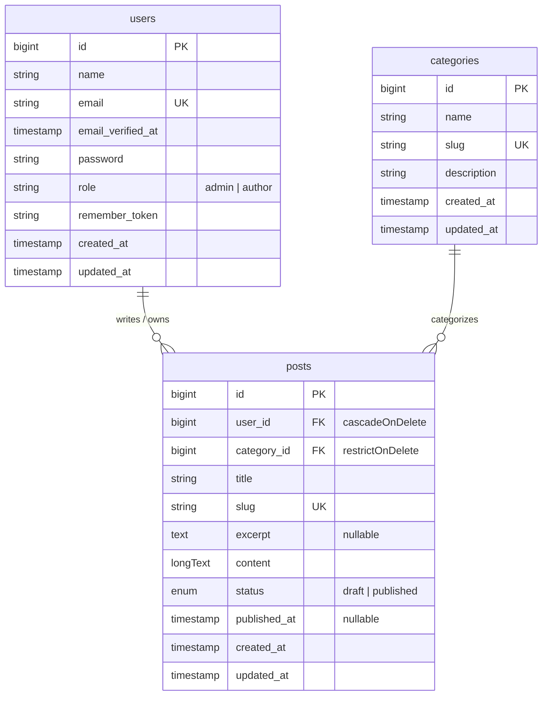

# Mini CMS

A modern, lightweight Content Management System built with a **Laravel API** backend and a **Next.js 16 (App Router)** frontend.

---

## 🛠️ Tech Stack

### **Backend**
- **Framework:** Laravel 11 / PHP 8.3
- **Authentication:** Laravel Sanctum (Cookie-based Session Auth)
- **Database:** MySQL
- **ORM:** Eloquent ORM

### **Frontend**
- **Framework:** Next.js 16 (App Router) & React 19
- **Language:** TypeScript
- **Data Fetching:** TanStack React Query v5
- **State Management:** Zustand
- **Form & Validation:** React Hook Form & Zod
- **Styling:** Tailwind CSS v4 & @tailwindcss/typography
- **UI Components:** shadcn/ui & Lucide Icons
- **Notifications:** Sonner
- **Markdown:** react-markdown & remark-gfm

---

## 🚀 Installation & Setup

### **Prerequisites**
- PHP >= 8.3 & Composer
- Node.js >= 20 & npm
- MySQL Server

---

### **1. Backend Setup (Laravel)**

Navigate to the `backend` directory:

```bash
cd backend
```

1. Install PHP dependencies:
   ```bash
   composer install
   ```

2. Environment configuration:
   ```bash
   cp .env.example .env
   ```
   *Configure your database credentials (`DB_DATABASE`, `DB_USERNAME`, `DB_PASSWORD`) in `.env`.*

3. Generate application key:
   ```bash
   php artisan key:generate
   ```

4. Run database migrations & seeders:
   ```bash
   php artisan migrate --seed
   ```

5. Start the Laravel development server:
   ```bash
   php artisan serve
   ```
   *Backend API runs at `http://localhost:8000`*

---

### **2. Frontend Setup (Next.js)**

Navigate to the `frontend` directory:

```bash
cd frontend
```

1. Install Node dependencies:
   ```bash
   npm install
   ```

2. Environment configuration:
   Create a `.env.local` file:
   ```env
   NEXT_PUBLIC_API_URL=http://localhost:8000/api
   ```

3. Start the Next.js development server:
   ```bash
   npm run dev
   ```
   *Frontend application runs at `http://localhost:3000`*

---

## 🎯 Use Cases

| Use Case ID | Use Case Name | Actor(s) | Description | Access Level |
|:---:|---|---|---|:---:|
| **UC-01** | **View Published Posts** | Guest, Author, Admin | Browse published articles and read full post details by slug | Public |
| **UC-02** | **Sign In** | Guest, Author, Admin | Authenticate with email & password via Sanctum session | Public |
| **UC-03** | **Manage Own Posts** | Author, Admin | Create, edit, publish, and delete posts created by the current user | Author / Admin |
| **UC-04** | **Manage All Posts** | Admin | View all posts (including drafts), edit, publish, or delete any post | Admin Only |
| **UC-05** | **Manage Categories** | Admin | Create, edit, and delete post categories (full CRUD) | Admin Only |
| **UC-06** | **Manage Users** | Admin | Create, update roles, and manage user accounts (full CRUD) | Admin Only |

---

## 🗄️ Entity Relationship Diagram (ERD)



---

## 📄 Author & License

Created and maintained by **Muhammad Fatihul Iqmal**.
